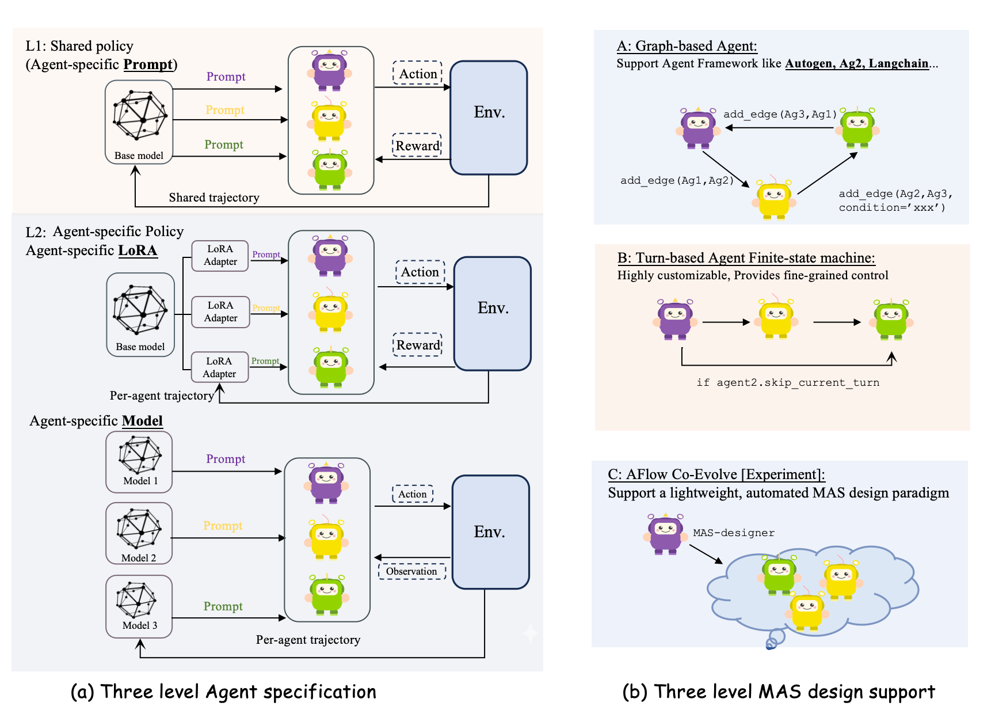

<div align="center">
  
  <h1>PETTINGLLMS</h1>
  <p>🚀 面向协作式与自组织 LLM 智能体训练的强化学习框架。</p>
  <p>
    <a href="https://pettingllms-ai.github.io/">🌐 网站</a> •
    <a href="https://www.youtube.com/watch?v=8WM-gVTrSBc">🎮 演示</a> •
    <a href="https://pettingllms-docs.readthedocs.io/en/latest/">📖 文档</a> •
    <a href="https://pettingllms-docs.readthedocs.io/en/latest/About_us/">👥 关于我们</a> •
    <a href="figs/wechat.jpg"> PettingLLMs</a>
  </p>
</div>

<div align="center">
  <strong>Language / 语言</strong><br>
  <a href="./README.md">English</a> • 中文
</div>

---

PettingLLMs 是一个面向多智能体大语言模型的开源在线强化学习框架，目前主要支持两条研究主线：

- **🆕 Metaagent-X — *Breaking the Ceiling of Automatic Multi-Agent Systems via End-to-End Reinforcement Learning.* &nbsp;[📄 arXiv:2605.14212](https://arxiv.org/abs/2605.14212)**：一个端到端框架，让 agent 模型既能**自动设计**自己的多智能体系统（MAS），也能**自动执行**该系统，并对元设计器与执行器进行联合优化。
- **Stronger-MAS — *On-Policy Reinforcement Learning for Collaborative LLMs.* &nbsp;[📄 arXiv:2510.11062](https://arxiv.org/pdf/2510.11062)**：提出 Agent- and Turn-wise Group Relative Policy Optimization（AT-GRPO），用于在固定多智能体系统拓扑中训练协作型 LLM agent，支持细粒度的按 agent / 按轮次信用分配与角色专属策略。

## 1. Metaagent-X：端到端可训练的自动化 MAS

[📄 论文（arXiv:2605.14212）](https://arxiv.org/abs/2605.14212)

[🪄 模型](https://huggingface.co/Mercury7353/MetaAgent-X)

[🏆 项目主页](https://mercury7353.github.io/MetaAgent-X-Page/)

<div align="center">
  
  <p><em>A. 三类自动化 MAS 范式对比。B. Metaagent-X 训练框架总览。</em></p>
</div>

多智能体系统在医疗决策、科学发现、金融交易、软件工程和硬件设计等场景中，已经展现出明显优于单智能体方案的能力。近期研究越来越多地转向能够自动为任务设计并实例化 MAS 流程的 meta-agent；与此同时，agentic RL 与自演化范式也在让 LLM 逐渐成为可交互、可持续优化的决策系统。

但现有自动化 MAS 依然只是“部分自适应”：要么只在推理时搜索 MAS 结构，要么只优化设计器，同时把下游执行器冻结。Metaagent-X 试图打破这个上限，让 agent 模型能够端到端地同时完成 MAS 的自设计与自执行。针对具体任务生成的 auto-MAS 会被实例化、执行、分组和收集，并用于同时更新设计器和执行器的角色感知策略，因此执行器不再是元设计器能力的硬上限，设计器也能反过来诱导执行端形成更专业化的行为模式。

它主要解决了以往自动化 MAS 的两个核心问题：

1. **参数层面的割裂。** 设计器与执行器只在推理时通过 prompt 交互，执行结果并不会反向更新底层策略参数。
2. **协同进化机制不清晰。** 设计器与执行器在联合训练中究竟如何共同演化、各自能力提升来自哪里，过去并没有很清楚的实践解释。

### 结果

在六个数学和代码基准以及两种底座模型上，Metaagent-X 相比单智能体和自动化 MAS 基线最高可提升 21.7%。消融实验显示：

1. 设计器与执行器都会在跨任务、跨领域训练过程中持续提升。
2. 更有效的共同演化通常呈现出分阶段推进的特点，两个组件都能从解耦优化中受益。

### 快速开始（Metaagent-X）

```bash
# 浏览器交互 Demo。
# 脚本会用 vLLM 部署 Mercury7353/MetaAgent-X，启动 Web UI，
# 用户可以输入数学/代码问题，并查看 MAS 设计与执行轨迹。
bash scripts/evaluate/autoevol/serve_ui.sh

# 如果模型已经在本机或远端服务好，只启动 UI：
START_VLLM=false HOST=127.0.0.1 PORT=8300 bash scripts/evaluate/autoevol/serve_ui.sh

# 一次性 CLI Demo，会输出 HTML 报告而不是启动网页：
QUESTION="Find the value of x if 2x + 3 = 17. Answer with a single number." \
bash scripts/evaluate/autoevol/serve_demo.sh

# 用发布模型先跑一轮 benchmark 评测
bash scripts/evaluate/autoevol/eval_first_open_model.sh

# 训练示例：共享策略协同训练，使用分层 M*N rollout
# 和分阶段交替学习率。
bash scripts/train/autoeval/example_cotrain_autoeval.sh
```

交互式 UI 默认运行在 `http://127.0.0.1:8899`。每次运行的产物会保存在 `outputs/autoeval_interactive/` 下，包括 `mas_design.py`、可执行的 `mas.py`、`execution.log`、`index.html`、重试记录以及 workflow 可视化结果。

界面会展示数学/代码示例、模型生成的 MAS 设计、执行流水线、AgentNode 轨迹、完整日志和最终结果。auto-MAS 环境、设计器/执行器 agent 与奖励函数位于 `pettingllms/multi_agent_env/autoevol/`，对应配置位于 `pettingllms/config/autoevol/`。

## 2. Stronger-MAS / AT-GRPO

[📄 论文（arXiv:2510.11062）](https://arxiv.org/pdf/2510.11062)

AT-GRPO（Agent- and Turn-wise Group Relative Policy Optimization）用于在固定 MAS 拓扑中训练协作型 LLM agent，并覆盖多种任务场景。

### 亮点

- 支持细粒度的 agent 级与轮次级信用分配。
- 支持基于 LoRA 的角色专属策略，或完全独立的多模型策略。
- 支持多层级奖励：过程奖励、单 agent 奖励、全局/团队奖励。
- 支持多模态示例，例如 Qwen2.5VL 的视觉+语言任务。
- 单智能体与多智能体训练流程之间可以平滑切换。

### 功能概览

| 能力 | PettingLLMs | AgentLightning / VERL（典型） |
| --- | ---: | ---: |
| Agent 专属 LoRA / 模型（每个 agent 不同 adapter 或不同底模） | ✅ | ❌（通常只共享一个模型） |
| 多层级奖励（过程 + agent + 全局/团队） | ✅ | ❌（多数只有全局奖励） |
| 细粒度分组（轮次 / 阶段 / 角色 / 工具调用） | ✅ | ❌（通常一个任务就是一组） |
| 多模态能力（见 Qwen2.5VL 示例） | ✅ | ❌ |

<div align="center">
  
</div>

**支持模式**

- ✅ 单智能体 RL 训练
- ✅ 多智能体 RL 训练（共享一个角色共享策略）
- ✅ 多智能体 RL 训练（不同角色使用不同 LoRA 或不同 LLM）

### Agent 规格层级

| 层级 | 规格类型 | 架构组件 | 轨迹流 | 说明 |
| :--- | :--- | :--- | :--- | :--- |
| **L1** | 共享策略（agent 专属 prompt） | 1 个底模 + 多套 prompt | 共享轨迹 | 所有 agent 共用同一个基础模型，角色差异由不同系统提示词定义。 |
| **L2** | Agent 专属策略（agent 专属 LoRA） | 1 个底模 + 多个 LoRA adapter | 按 agent 分轨迹 | 所有 agent 共用底模，但通过轻量角色专属 LoRA 完成专业化分工。 |
| **L3** | Agent 专属模型（全参数独立） | 多个独立模型 | 按 agent 分轨迹 | 每个 agent 运行独立模型实例，以获得最大程度的角色特化。 |

### MAS 设计方式

| 类别 | 设计范式 | 关键特性与支持 | 适用场景 |
| :--- | :--- | :--- | :--- |
| **A** | 图结构 agent | 拓扑灵活，可接 AutoGen、Ag2、LangChain 等框架。 | 需要复杂非线性流程和外部 agent 生态的场景。 |
| **B** | 轮转式 agent（有限状态机） | 控制粒度细，可自定义串行执行顺序。 | 需要严格操作次序和状态转换的场景。 |
| **C** | AFlow Co-Evolve [实验] | 通过轻量 MAS 设计器自动生成结构。 | 适合探索系统自优化结构的实验场景。 |

## 新闻

- **[2026.04]** 发布 Metaagent-X：支持自动化 MAS 的自设计与自执行端到端强化学习；在六个数学/代码基准上最高超过基线 21.7%。
- **[2025.12]** 路线图阶段性完成：新增更多环境（Verilog 设计、Web 搜索、机器人、数据库查询、科学发现），支持多模态与更多 agent 框架集成（AutoGen、LangGraph、LlamaIndex）。
- **[2025.10]** GitHub 仓库正式开源。
- **[2025.10]** 发布 AT-GRPO（Stronger-MAS）论文：[arXiv 预印本](https://arxiv.org/pdf/2510.11062)。
- **[2025.10]** 支持按角色使用不同 LoRA adapter，提升角色专属训练效率。
- **[2025.09]** 新增多环境支持：游戏（Sudoku、Sokoban）、代码（APPS、CodeContests）、数学（AIME、OlympiadBench）。
- **[2025.08]** 完成多智能体框架实现，支持共享单模型和角色专属模型两种模式。

## 安装

```bash
git clone https://github.com/pettingllms-ai/PettingLLMs.git
cd PettingLLMs
bash setup.bash
```

## 快速开始

### 1）准备数据集

```bash
# 代码任务（APPS、CodeContests、LiveCodeBench）
python scripts/dataprocess/load_code.py

# 数学任务（AIME24/25、OlympiadBench）
python scripts/dataprocess/load_math.py

# 游戏 / 规划任务（Sokoban、Sudoku）
python scripts/dataprocess/load_sokoban.py
```

数据会保存到 `datasets/code/`、`datasets/math/` 和 `datasets/sudoku_environments/`。

### 2）训练

```bash
# Metaagent-X：共享策略协同训练，使用 M*N 分层 rollout
bash scripts/train/autoeval/example_cotrain_autoeval.sh

# AT-GRPO：在数学任务上训练固定多智能体系统
bash scripts/train/math/math_L1_prompt.sh
```

更多 AT-GRPO 训练脚本位于 `scripts/train/`：

- `code_single_policy.sh`、`code_two_policy.sh`：代码任务
- `plan_path_single.sh`、`plan_path_two_policy.sh`：规划任务
- `sokoban_two_policy.sh`、`sokodu_single.sh`：游戏任务

### 3）评测

先编辑 `scripts/evaluate/evaluate.sh`，设置模型路径和配置：

```bash
MODEL_PATHS=("/path/to/your/model")
CONFIG_NAME="math_single_policy"
```

然后运行：

```bash
bash scripts/evaluate/evaluate.sh
```

对于 MetaAgent-X，默认可以直接用发布模型跑：

```bash
bash scripts/evaluate/autoevol/eval_first_open_model.sh
```

## 引用

如果这个项目对你的研究或工程有帮助，欢迎引用相关论文：

```bibtex
@misc{zhang2026metaagentxbreakingceiling,
      title={MetaAgent-X : Breaking the Ceiling of Automatic Multi-Agent Systems via End-to-End Reinforcement Learning},
      author={Yaolun Zhang and Yujie Zhao and Nan Wang and Yiran Wu and Jiayu Chang and Yizhao Chen and Qingyun Wu and Jishen Zhao and Huazheng Wang},
      year={2026},
      eprint={2605.14212},
      archivePrefix={arXiv},
      primaryClass={cs.AI},
      url={https://arxiv.org/abs/2605.14212},
}

@article{zhao2025stronger,
  title={Stronger Together: On-Policy Reinforcement Learning for Collaborative LLMs},
  author={Zhao, Yujie and Hu, Lanxiang and Wang, Yang and Hou, Minmin and Zhang, Hao and Ding, Ke and Zhao, Jishen},
  journal={arXiv preprint arXiv:2510.11062},
  year={2025}
}
```

## 致谢

本项目主要由 Yujie Zhao 在 **Intel Corporation** 实习期间完成，感谢 Intel 提供的支持与资源。

- **VERL**: [VERL: Efficient RL Training for LLMs](https://github.com/volcengine/verl)，提供高效的分布式 RL 训练基础设施。
- **RLLM**: [RLLM: Reinforcement Learning with Language Models](https://github.com/rllm-org/rllm)，提供语言模型强化学习相关基础算法支持。

## 许可证

本项目采用 MIT License，详见 `LICENSE`。
